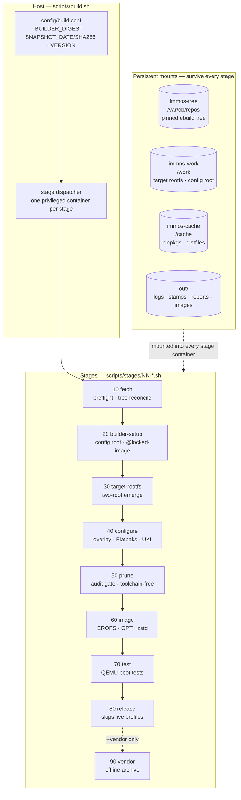
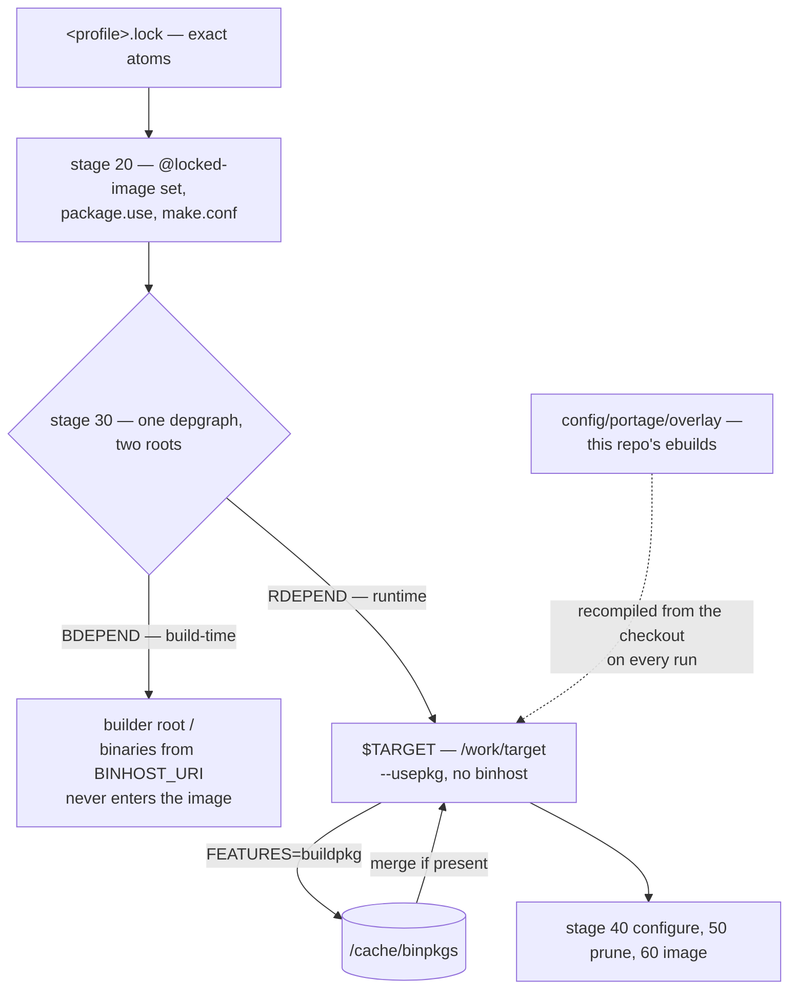

# Pipeline

`scripts/build.sh` is the host entry point. It builds the `immos-builder` container image from `builder/Dockerfile`, then dispatches each stage script in `scripts/stages/` as its own `docker run --rm --privileged` (or Podman equivalent). One container per stage keeps logs and resume boundaries clean.

## Volumes and mounts

| Volume or bind | Container path | Content |
|---|---|---|
| `immos-work` (named volume) | `/work` | Target rootfs per profile (`/work/target[-<profile>]`), the assembled portage config root (`/work/config[-<profile>]`), staleness fingerprints |
| `immos-cache` (named volume) | `/cache` | Binary packages (`/cache/binpkgs`), source tarballs (`/cache/distfiles`), the parked tree snapshot with its signature; see [Build cache](cache.md) |
| `immos-tree` (named volume) | `/var/db/repos` | The pinned ebuild tree plus the `.tree-pin` marker |
| Repository (bind, read-only) | `/repo` | The checkout |
| `out/` (bind) | `/out` | Logs, stamps, reports, artifacts |
| Vendor archive (bind, read-only) | `/vendor` | The stage-90 archive; present only with `--vendor-dir` |

## Stages

Each stage runs as its own privileged container against the persistent mounts; the table carries the per-stage detail.

| Stage | Script | Purpose |
|---|---|---|
| 10 | `scripts/stages/10-fetch.sh` | Builder preflight: verify every tool later stages shell out to; reconcile the tree volume against the `SNAPSHOT_DATE`/`SNAPSHOT_SHA256` pin; assert the builder's own closure matches `builder.lock` |
| 20 | `scripts/stages/20-builder-setup.sh` | Assemble the target portage config root at `/work/config`; render the committed lock into the `@locked-image` set; verify every locked atom still exists in the pinned tree; prune binhost-sourced packages from the cache |
| 30 | `scripts/stages/30-target-rootfs.sh` | The two-root emerge: build-time dependencies merge into the builder's own `/`, runtime dependencies merge into `$TARGET`; verify the resulting package database against the lock in both directions |
| 40 | `scripts/stages/40-configure.sh` | Apply the `config/rootfs/` overlay, create users — for `live` profiles, the touched account files (including the `live` user's) move straight to `$TARGET/var/overlay/etc/upper`, never the lower `/etc` (plan/34 §5) — enable systemd presets, preinstall pinned Flatpaks, run chroot finalizers, build the dracut initrd and UKI for `target` profiles; a `live` profile builds neither here (its UKI is a re-wrap stage 60 builds instead) and stages only `BASE_PROFILE`'s UKI and a `var-base.tar.zst` as its payload, plus unpacks that build's own Flatpak store straight into the medium's own `/var/lib/flatpak` (plan/34 §7.1) |
| 50 | `scripts/stages/50-prune.sh` | Unmerge build-only packages, prune firmware and microcode trees, run the audit gate against `config/portage/expected-packages.<profile>.txt`, assert the target is toolchain-free, delete the target package database |
| 60 | `scripts/stages/60-image.sh` | Loopless image assembly: build the root EROFS, the ext4 `/var` image and the vfat ESP with userspace tools, place them into a GPT image by `dd` at computed offsets, verify filesystem magics, compress with zstd. For a `live` profile, the root partition is `BASE_PROFILE`'s own EROFS dd'd in unchanged, the difference between the two trees becomes a `systemd-sysext` extension staged onto the `/var` image, and the live UKI is `BASE_PROFILE`'s UKI re-wrapped with `live_*` cmdline labels (plan/34 §7.2, §8) |
| 70 | `scripts/stages/70-test.sh` | QEMU/OVMF boot tests: T1 smoke by default; T2 update end-to-end when `UPDATE_TEST_BASE_IMG` names an older image. See [Testing](testing.md) |
| 80 | `scripts/stages/80-release.sh` | Assemble the release channel layout under `out/release/<channel>/` with `SHA256SUMS` (optionally GPG-signed); refuses live profiles and builds that ran with `ALLOW_UNPINNED=1` |
| 90 | `scripts/stages/90-vendor.sh` | Build the offline release archive; runs only with `--vendor`. At 13–14 GB this is a release artifact, not a per-run output |

Stage 90 archives the signed snapshot tarball, the complete distfiles closure, `/cache/binpkgs`, the Flatpak store and the builder image; `scripts/build.sh` additionally saves the container image tarballs host-side. An offline rebuild consumes the archive; see [Build cache](cache.md#offline-rebuilds).

## Stamps and resume

Each stage writes `out/state[-<profile>]/<NN>-<name>.done` containing an inputs hash of that stage's inputs. The dispatcher runs every stage it reaches — stages are idempotent, and the expensive work is skipped inside the stage by portage's own cache semantics (binary packages, already-installed atoms). Resume after a failure is explicit: `bash scripts/build.sh --from NN`. Stamps record state for inspection and for `--clean`; no mechanism skips a stamped stage automatically.

## Determinism

`SNAPSHOT_DATE` feeds `SOURCE_DATE_EPOCH`, which stage 60 stamps onto every EROFS inode through `mkfs.erofs -T`. Two builds of the same commit with the same cache state produce the same image bytes. The EROFS build timestamp must be stable and non-zero; a zero or wall-clock timestamp breaks byte-reproducibility.

## The two-root emerge

Stage 30 installs each dependency into the root that needs it:

- Build-time dependencies (`DEPEND`: compilers, build tools) merge into the builder's own `/` and never enter the image.
- Runtime dependencies merge into `$TARGET` (`/work/target[-<profile>]`).

The target is toolchain-free by construction: no compiler, no headers, no `portage`. Stage 50 asserts the guarantee against the audit allowlist.

Binary provenance:

- The **target** never consumes `PORTAGE_BINHOST` and never sets `getbinpkg`. Everything the image ships is compiled by this pipeline or reused from `/cache/binpkgs`, which holds only packages this pipeline built. `tests/test-binpkg-policy.sh` and `tests/test-pin-policy.sh` assert this contract.
- The **builder's** own tools (qemu, dracut, rsvg-convert, …) install as binary packages from `BINHOST_URI` in `config/build.conf`.
- Packages from `config/portage/overlay/` (the managed-mode KCM and the installer accounts page) are recompiled from the checkout on every stage-30 run (`--reinstall-atoms` with `--usepkg-exclude`); a stale binary of an overlay package is never merged.

## Staleness guards

Stage 30 refuses to run against state that no longer matches the checkout:

| Guard | Compares | Failure means |
|---|---|---|
| Config-root freshness | `portage_config_hash()` against `/work/config*/.inputs-hash` | `config/portage` or `config/build.conf` changed and stage 20 has not re-run; re-run `--only 20` |
| Target-root staleness | `target_closure_hash()` against `/work/target-config-hash*` | The target root carries package membership the current config would drop; remove the work volume and rebuild — see [Build cache](cache.md#invalidation) |

`target_closure_hash()` is `portage_config_hash()` minus the overlay's source trees: a C++ or QML edit cannot change package membership and does not invalidate the target root.

Every stage that resolves a dependency graph calls `tree_assert()`, which compares the `.tree-pin` marker in the tree volume against the pin in `config/build.conf` and refuses to resolve against any other tree.
